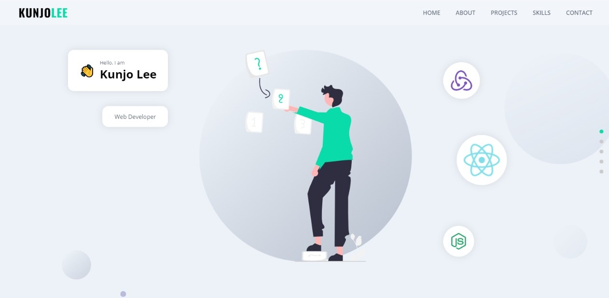
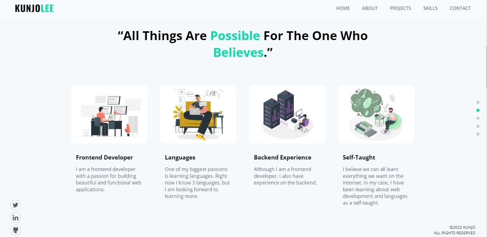
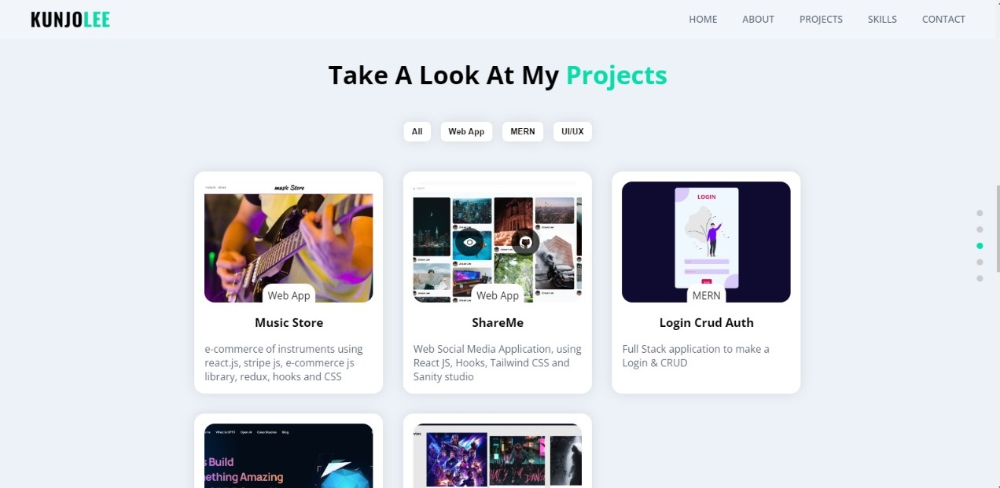
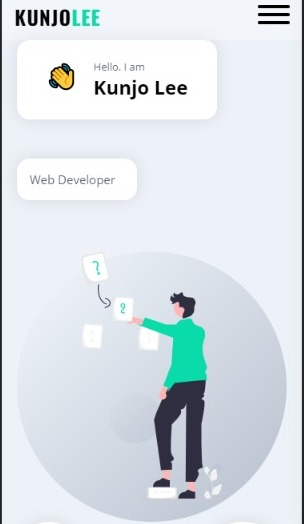
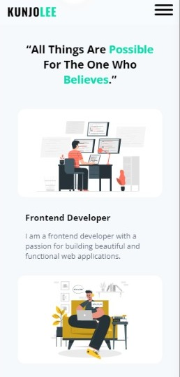
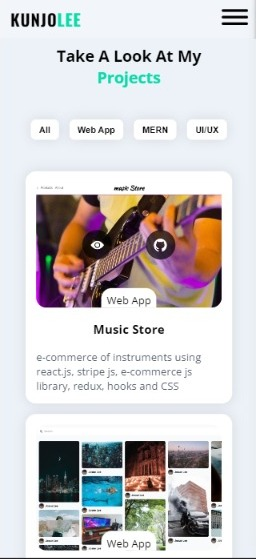

# This is my personal website.

This is my portfolio, where you can find some of my projects, get to know me, and contact me.
I made this website using vanilla JS, HTML, and CSS.
- AJAX
- BEM CSS methodology
- Form Submit library
- Intersection Observer

## Desktop Version

## Mobile Version

